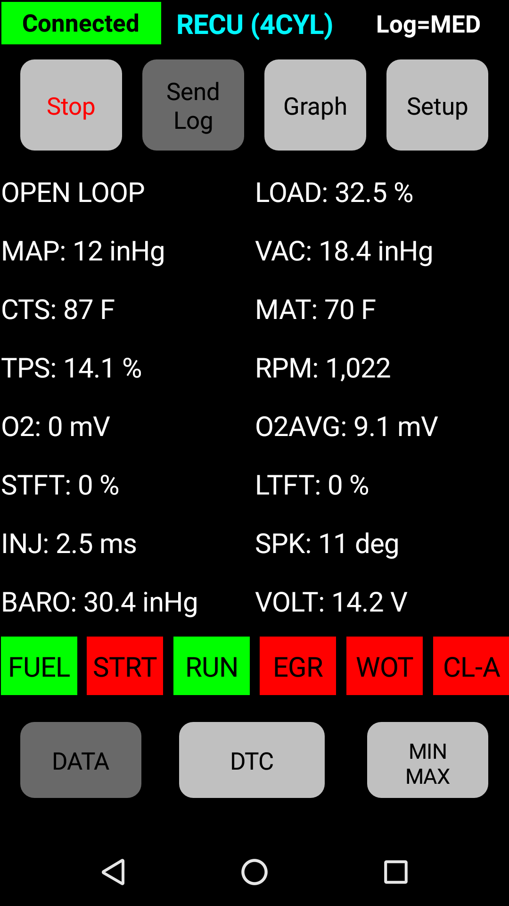

# RECU    
### Renix ECU Reader

The ESP32 microcontroller attached to the **RECU** control board is programmed with [Arduino](https://www.arduino.cc). The [RECU](https://play.google.com/store/apps/details?id=cmarsoft.recu) Android app connects via bluetooth to the ESP32 that is connected to the Jeep diagnostic port via serial link. Mine has been connected full time for several months with no problems.

## RECU control board
The circuit to gather information from the ECU is a modified version of a design by John Eberle of TractorEnvy.com.  Board was designed using freeware version of Diptrace and made by [OshPark](https://oshpark.com/shared_projects/BllhAg80).  The ECU packet structure and parts of the arduino code are based on the work of Nick Risley of NickInTimeDesign.com.

 
  

### Bill of Materials
* 1: RECU printed circuit board
* 1: 03-09-2151 Molex 15 Circuit Plug
* 4: 02-09-2134 Molex PC Tail Male
* 1: RenCom R-78E6.5-0.5 DC/DC Converter 0.5A 6.5V
* 1: Bel 0ZRR0030FF1E PPTC Resettable Fuse 300mA
* 1: Four position PCB mount screw terminals
* 1: ESP-32S Dual Development Board
* 1: 1N5817 Schottky Rectifier Diode
* 1: 150 Ohm .25w Resistor
* 1: 2200 Ohm .25w Resistor
* 1: 4700 Ohm .25w Resistor
* 1: 3300 Ohm .25w Resistor
* 1: 1000 Ohm .25w Resistor
* 1: 2N3904 Transistor
* 1: 20AWG four conductor cable, 6-8 ft
* 1: Printed Connector cover (optional)

## Screenshots of RECU running on Android phone
Find [RECU](https://play.google.com/store/apps/details?id=cmarsoft.recu) on Google Play.

   
