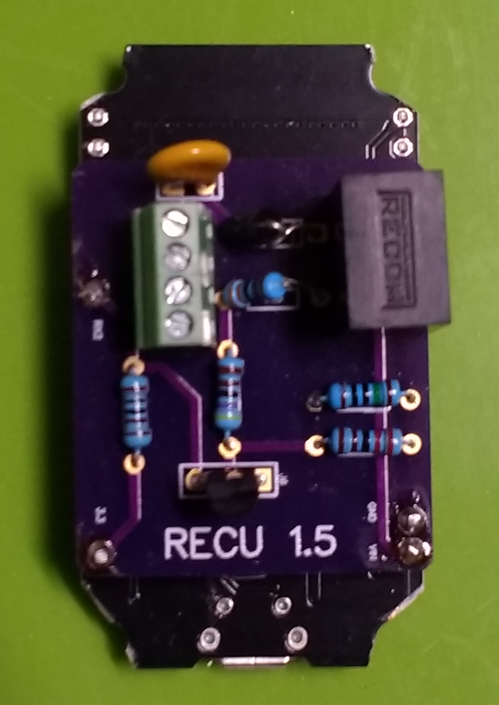
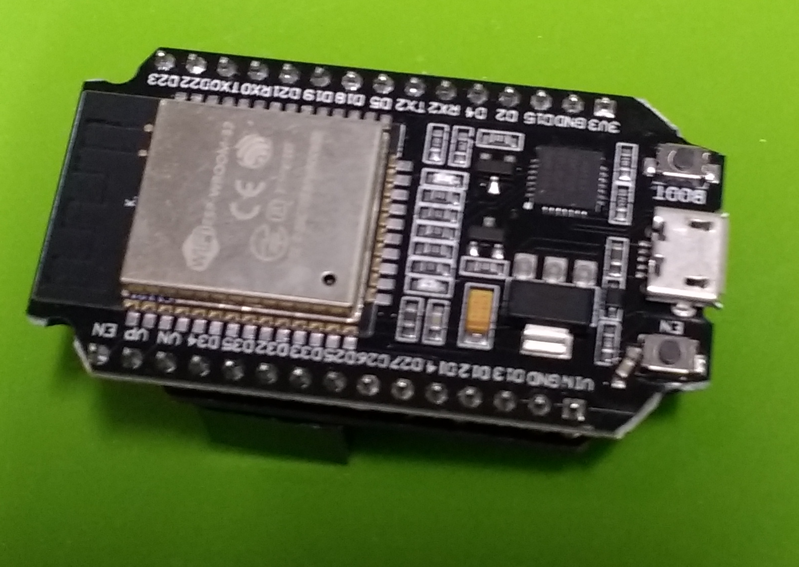

# RECU    
### Renix ECU Reader

The **RECU** Android app is developed with [B4A](https://www.b4x.com/b4a.html) by Anywhere Software.  The ESP32 microcontroller attached to the **RECU** control board is programmed with [Arduino](https://www.arduino.cc) by Anywhere Software. The app connects via bluetooth to the ESP32 that that is connected to the Jeep diagnostic port via serial link.

## RECU control board
The circuit to gather information from the ECU is based on a design by J. Eberle of TractorEnvy.com.  

 

## Screenshot of RECU running on Android phone
The ECU packet structure is based on the work of Nick Risley of NickInTimeDesign.com.  

